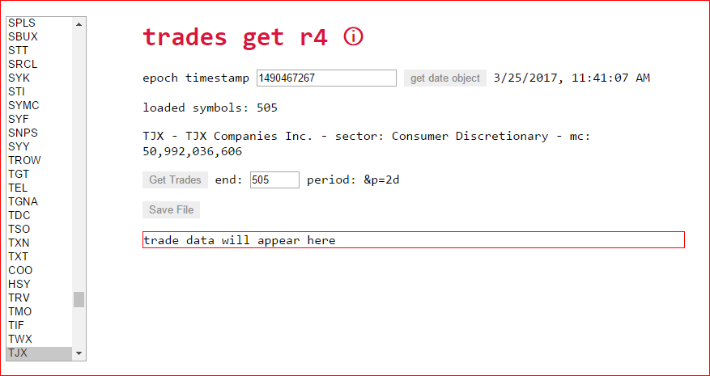

[You are now in a GitHub source code view - click this button to view this read me file as a web page]( https://jaanga.github.io/sp500/trades-get/ "View file as a web page." ) 

<input type=button value='You are now in GitHub web page view - Click this button to view Read Me file as source code' onclick=window.location.href='https://github.com/jaanga/sp500/tree/gh-pages/trades-get/'; />

### [Jaanga]( https://jaanga.github.io/ ) &raquo; [Jaanga SP500 Read Me]( https://jaanga.github.io/sp500/index.html ) &raquo;

[Jaanga SP500 Trades Get Read Me]( https://jaanga.github.io/sp500/#trades-get/README.md )
===
_request and obtain intraday trades for hundreds of stock market symbols for a number of days_

### Full Screen Demo: [Jaanga SP500 Trades Get ]( https://jaanga.github.io/sp500/trades-get/index.html )

## Web Page

<iframe src="https://jaanga.github.io/sp500/trades-get/index.html" width=100% height=600px ></iframe>

## Concept

Request and obtain stock market intraday data for hundreds of symbols sourced via Wikipedia, Google and Yahoo

### Issues / Problems

### Mission
<!-- a statement of a rationale, applicable now as well as in the future -->

### Vision
<!--  a descriptive picture of a desired future state -->

### Wish List / To Do

* Move to Google SS and daily trigger
* Select exchange & portfolio
* Get trades for selected symbols or portfolio of issues not in sp500
* Display start index
* Add display date that will be saved << make more apparent

## Usage Notes

## Copyright and License

* [Copyright and License]( https://jaanga.github.io/#https://jaanga.github.io/jaanga-copyright-and-mit-license.md )

## Change Log & Developer Notes

### 2017-04-07 ~ Theo

* Updated the select symbol bits
* Better error checking in loading Google SS / Wikipedia data

### 2017-04-05 ~ Theo

* Add getStart
* Fix brk.b issues again

### 2017-04-04 ~ Theo

Code could use much cleanup and streamlining

* Fixed issues when there's a day with a new symbol
* Added get single day of ticks

### 2017-03-25 ~ Theo

Search and select is not really needed here but it's a simpler sandbox to play in compared to replay or realtime.
But might help later with portfolio creation

* Trades Get R5
* Add search and select subset of symbols via text input
* Add full read me

***

# <a href=javascript:window.scrollTo(0,0); style=text-decoration:none; >❦</a>

